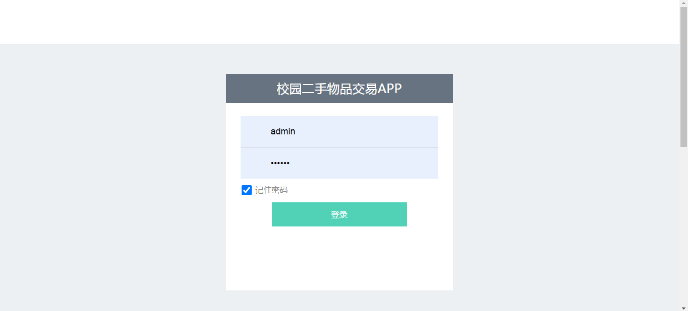
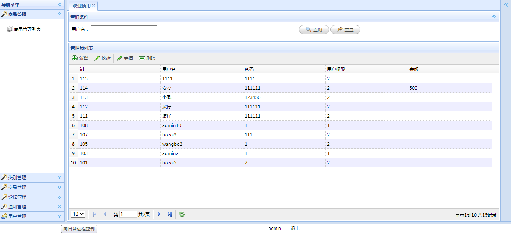
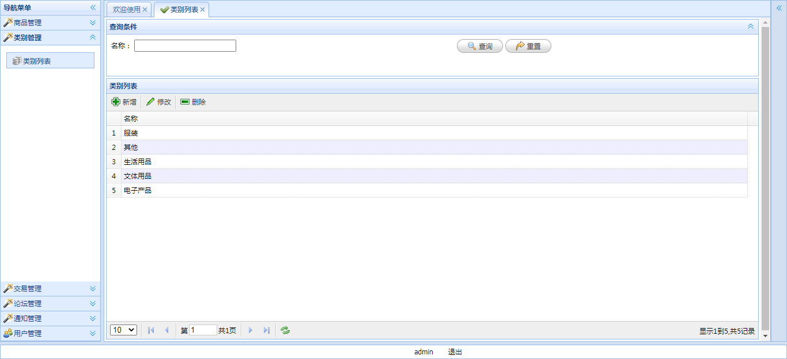
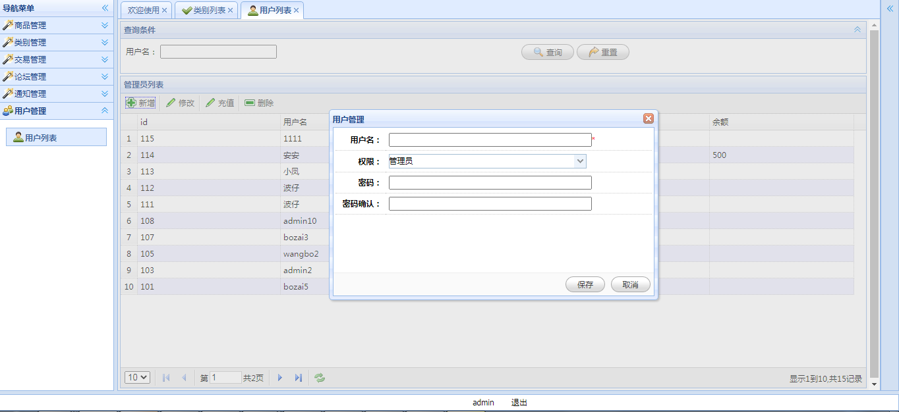

<h1 align="center">校园二手物品交易管理系统</h1>

## 简介
校园二手物品交易管理系统：角色分为管理员、用户；核心功能包括商品管理、类别管理、用户管理、交易管理、公告管理。界面设计简洁，支持快速访问和高效操作。    --计算机毕业设计源码；毕设源码；java毕业设计源码

## 联系方式

<h3 align="center">获取完整代码与数据库文件 + 微信：deepguan QQ: 86050149 QQ群: 783742310</h3>

<h3 align="center">可帮忙远程部署 包运行成功！提供远程部署、修改代码、设计文档指导、代码讲解等服务！</h3>

## 功能介绍（完整见运行截图）
管理员：负责用户管理，包括新增、修改、删除用户，以及充值用户余额。具备商品管理、类别管理、交易管理和公告管理的权限。支持通过输入用户名进行用户查询，并可根据需要创建、修改、删除商品类别，进行用户权限设置及全系统的身份验证功能。  
用户：通过系统登录界面进入平台，享有查看商品、购买商品及进行相关交易的权限。用户可以在交易平台上浏览商品类别，并通过搜索功能找到所需商品。用户的信息可在系统中注册登记，并由管理员根据需要进行账户余额的充值管理。

## 运行截图

本代码来源于网络,仅供学习参考使用!

